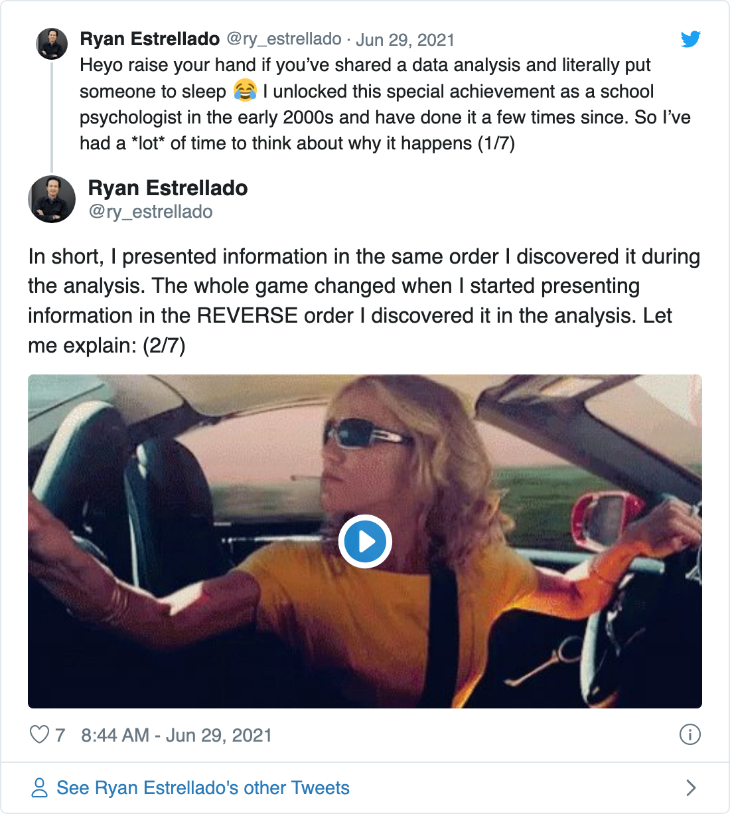

How I Use Stories to Share Data at Meetings (R Edition)
================
Ryan Estrellado
May 8, 2022

## Want to keep people awake at data presentations? Try sharing your findings backwards. You’ve worked it. Now put your charts down, flip it and reverse it.

The first time I put someone to sleep with a data presentation was in
2003.

I was a school psychologist in a public school here in the United
States. That meant, among other things, that I tested elementary school
students for learning disabilities. Then I’d share the results at
meetings with parents and school staff so we could all help the student
better.

At one of these meetings, as I soldiered through every single data point
of my tests, I noticed a teammate had gone silent. At first I thought
she was using active listening skills. Then it struck me that one can’t
do that with their eyes closed.

Yes, she was sleeping. In providing a safe place to nap, I had done a
service for the public education community. But it wasn’t the service I
was paid to do.

Over the next few years, people fell asleep at my meetings more times.
And recently, I realized what I was doing wrong. In this article, I’ll
be sharing those lessons with you.

# Sequence Well or Risk Slumber

If this article were called, “How to Put People to Sleep With Data
Presentations,” the main point would be this: Present findings to your
audience in the same sequence that you discovered them. That’s exactly
what I did all those years as a school psychologist. And we already know
how that turned out. So what to do?

In Season 5, Episode 21 of *Seinfeld*, George Costanza laments his bad
fortune and resolves to do the opposite of every choice he’s ever made:

> No wait a minute. I always have tuna on toast. Nothing’s ever worked
> out for me with tuna on toast. I want the complete opposite of tuna on
> toast. Chicken salad. On rye. Untoasted.

I had a similar experience reflecting on my data presentations. People
fell asleep when I shared my findings in the same order that I
discovered them. Like George, I wanted the complete opposite: Presenting
the findings in the *reverse* order that I discovered them. I mean, if
one way puts the audience to sleep, then shouldn’t the opposite way keep
them awake?

Or as Jerry puts it in that episode of *Seinfeld*, “If every instinct
you have is wrong, then the opposite would have to be right.”

<!-- -->

In the rest of this post I’ll share the sequence of steps I take to
discover my findings. Then I’ll reverse those steps to craft a story for
a presentation. I’ll explore the Palmer Penguins R package to show how
this idea works.

# The Analysis: Start With the Data Points

When I do any kind of data analysis, I follow some version of this
sequence:

1.  Look at all the data points
2.  Note interesting details
3.  Categorize details into interesting themes

I go through these steps to explore the Palmer Penguins dataset in the
next few sections. As I do, notice how I start with broad questions and
arrive at more specific themes.

## Look at All the Data Points

First, I’ll use a basic questions to start my exploration. During this
stage, I like to let my curiosity lead. When I look through the Palmer
Penguins dataset, I notice there are variables that describe
measurements:

``` r
library(tidyverse)
library(palmerpenguins)
```

``` r
glimpse(penguins)
```

    #> Rows: 344
    #> Columns: 8
    #> $ species           <fct> Adelie, Adelie, Adelie, Adelie, Adelie, Adelie, Adel…
    #> $ island            <fct> Torgersen, Torgersen, Torgersen, Torgersen, Torgerse…
    #> $ bill_length_mm    <dbl> 39.1, 39.5, 40.3, NA, 36.7, 39.3, 38.9, 39.2, 34.1, …
    #> $ bill_depth_mm     <dbl> 18.7, 17.4, 18.0, NA, 19.3, 20.6, 17.8, 19.6, 18.1, …
    #> $ flipper_length_mm <int> 181, 186, 195, NA, 193, 190, 181, 195, 193, 190, 186…
    #> $ body_mass_g       <int> 3750, 3800, 3250, NA, 3450, 3650, 3625, 4675, 3475, …
    #> $ sex               <fct> male, female, female, NA, female, male, female, male…
    #> $ year              <int> 2007, 2007, 2007, 2007, 2007, 2007, 2007, 2007, 2007…

So for this example, I use this question: Do different species of
penguins have different measurements?

When I’m exploring a dataset, I visualize the data in different ways.
Again, at this stage, I’m not overthinking it. It’s more like sketching
ideas than it is painting a masterpiece.

I’m curious about differences in measurements, so I plot the bill
length, bill depth, and flipper length. I use a scatter plot because I
want to see each data point. I also color the points by species, based
on the hunch that different species have different measurements:

``` r
ggplot(penguins, aes(x = body_mass_g, y = bill_length_mm, color = species)) +
  geom_point() + 
  labs(title = "Bill Length By Species")
```

<!-- -->

``` r
ggplot(penguins, aes(x = body_mass_g, y = bill_depth_mm, color = species)) + 
  geom_point() + 
  labs(title = "Bill Depth By Species")
```

<!-- -->

``` r
ggplot(penguins, aes(x = body_mass_g, y = flipper_length_mm, color = species)) + 
  geom_point() + 
  labs(title = "Flipper Length By Species")
```

<!-- -->

I also find the average length of these measurements by penguin species:

``` r
penguins |> 
  group_by(species) |> 
  summarize(mean_bill_length = mean(bill_length_mm, na.rm = TRUE), 
            mean_bill_depth = mean(bill_depth_mm, na.rm = TRUE), 
            mean_flipper_length = mean(flipper_length_mm, na.rm = TRUE), 
            mean_body_mass = mean(body_mass_g, na.rm = TRUE))
```

    #> # A tibble: 3 × 5
    #>   species   mean_bill_length mean_bill_depth mean_flipper_length mean_body_mass
    #>   <fct>                <dbl>           <dbl>               <dbl>          <dbl>
    #> 1 Adelie                38.8            18.3                190.          3701.
    #> 2 Chinstrap             48.8            18.4                196.          3733.
    #> 3 Gentoo                47.5            15.0                217.          5076.

I’ve plotted and summarized the data to help me spot interesting
details. Now I’ll play with some language to describe what I notice.

## Note Interesting Details

Here’s where my exploration pays off. Where in the last section I led
with my curiosity, in this session I start focusing on details. Or as
the design thinkers would say, the last section was for divergent
thinking. This section is for convergent thinking:

-   The Chinstrap penguins have the highest mean bill length, though
    it’s similar to the Gentoo’s bill length
-   The Chinstrap penguins have the highest mean bill depth, though the
    Adelie’s are very close
-   The Gentoo penguins have the highest mean flipper length, followed
    by the Chinstrap, and then the Adelie

## Categorize Details Into Interesting Themes

I think of themes as a collection of interesting details. Interesting
details on their own are just that—interesting details. But when I
describe what they have in common, I get something else—the beginnings
of a story.

For example, I can play with different ways to describe what I pointed
out in the last section:

-   Patterns in species measurements
-   Differences, but also similarities
-   The Chinstrap penguins trade bill size for flipper size

By this point in the process, I’ve explored the data and found
interesting details. Then I played with ways to talk about those
details. Now, I’ll craft a way to share this with an audience.

The good news is most of the work is already done. But there’s one
important move I need to make if I want to avoid another snooze cruise.

# The Presentation: Start With the Story

Starting with the data points and ending with the story doesn’t set the
tone for a compelling discussion. It’s like inviting your friends over
for dinner, then showing them your timeshare presentation before
bringing out the food. They were there for the shrimp cocktail and
gossip. That needs to come first if you want to keep them happy.


Here’s how I would present the information:

1.  Point out interesting themes
2.  Describe selected details
3.  Show selected data points

I go through these steps to present the findings in the next few
sections. As I do, notice how I start with a story before supporting it
with selected data points.

## Point Out Interesting Themes

The first part is the hook. It’s how you set the tone. So open with the
story and let your audience know you’ve got something to share. And
remember, you can’t *make* them be interested, but you can show them
that *you’re* interested.

You might open the presentation for the Palmer Penguins exploration like
this:

> I was expecting to see some differences in measurements. These are
> different species of penguins, after all. But it turns out it’s not as
> simple as one species being bigger than the others.

## Describe Selected Details

The second part is about unpacking interesting details. It’s how you
signal credibility. Whatever it is you found so interesting isn’t made
up. You discovered it by doing an actual analysis:

> There’s one example of this that stuck to me. The Chinstrap penguins
> had bigger bills on average. But surprisingly, they didn’t have the
> biggest average flipper length.

## Show Selected Data Points

And now comes the data. This part is about digging a level deeper and
showing your audience exactly what you saw. What really works here is
the context. You’ve already set the stage with your theme and details.
Now the data helps your audience see how you arrived at the story:

> Let me show you what I mean. Here’s a plot that compares the bill
> length of all three species:

``` r
ggplot(penguins, aes(x = body_mass_g, y = bill_length_mm, color = species)) +
  geom_point() + 
  labs(title = "Bill Length By Species", 
       x = "Body mass in mm", 
       y = "Bill length in mm", 
       caption = "Data: Palmer Penguins", 
       color = "Species") 
```

<!-- -->

> And here’s one that compares the flipper length of all three species:

``` r
ggplot(penguins, aes(x = body_mass_g, y = flipper_length_mm, color = species)) + 
  geom_point() + 
  labs(title = "Flipper Length By Species", 
       x = "Body mass in mm", 
       y = "Flipper length in mm", 
       caption = "Data: Palmer Penguins",  
       color = "Species") 
```

<!-- -->

> See what I mean? The Chinstrap penguins tend to have longer bill
> lengths. But they didn’t tend to have longer flipper length. That
> crown goes to the Gentoo. You can see that more in this table of mean
> measurements:

``` r
penguins |> 
  group_by(species) |> 
  summarize("Mean Bill Length" = mean(bill_length_mm, na.rm = TRUE), 
            "Mean Flipper Length" = mean(flipper_length_mm, na.rm = TRUE)) |>
  rename("Species" = species) |> 
  arrange(desc("Mean Bill Length"))
```

    #> # A tibble: 3 × 3
    #>   Species   `Mean Bill Length` `Mean Flipper Length`
    #>   <fct>                  <dbl>                 <dbl>
    #> 1 Adelie                  38.8                  190.
    #> 2 Chinstrap               48.8                  196.
    #> 3 Gentoo                  47.5                  217.

# Conclusion

So that’s it. Start your data analysis by looking at many data points.
Then describe it through an interesting story. Afterward, start your
presentation by leading with a story. Then signal the rigor of your
analysis with supporting data points.

When you do this, you’ll be creating one less meeting where people nod
off. And more to the point of a data presentation, you’ll be creating a
fun environment where actual learning happens. Because who says truth
can’t also be entertaining?

*Ryan Estrellado is a writer and educator. He is the author of the book
[The K–12 Educator’s Data Guidebook: Reimagining Practical Data Use in
Schools](https://ryanestrellado.com/the-k12-educators-data-guidebook)
and a co-author of [Data Science in Education Using
R](https://ryanestrellado.com/data-science-in-education-using-r). Ryan
tells inspiring stories about the reality of education work, ranging
from overcoming a fear of data to finding a creative practice in the
workplace. He has over twenty years of experience in public education.
Ryan writes about [data-driven decision making in schools and how to
build creative education careers](ryanestrellado.com) at
ryanestrellado.com*

# Notes

1.  **flip it and reverse it**: Elliot, M (2002). “Work It,” *Under
    Construction*, The Goldmind, Inc. 

2.  **I’ll be sharing those lessons with you**: I’ve shared this
    technique in a video about [presenting school
    data](https://ryanestrellado.com/how-to-present-data-without-putting-people-to-sleep)
    and in my book about [data-driven decision making in
    schools](https://ryanestrellado.com/the-k12-educators-data-guidebook)

3.  **George Costanza laments his bad fortune**: [George’s clip on
    YouTube](https://youtu.be/CizwH_T7pjg)

4.  **we’ll see the sequence of steps**: This post has an example of
    numerical data, but I use this sequence when reflecting on interview
    responses or [other stories from educators in the
    field](https://podcasts.apple.com/us/podcast/donuts-in-the-lounge-a-podcast-for-educators/id1610942852).

5.  **Palmer Penguins Package**: Horst AM, Hill AP, Gorman KB (2020).
    *palmerpenguins: Palmer Archipelago (Antarctica) penguin data*. R
    package version 0.1.0.
    <https://allisonhorst.github.io/palmerpenguins/>. doi:
    10.5281/zenodo.3960218.

6.  **For this example, we’ll use this question**: You’ll likely be
    exploring your own data more thoroughly, but I’m keeping it simple
    for this post to illustrate the technique.

7.  **so I plot the bill length, bill depth, and flipper length**: There
    were some warnings about missing data. I didn’t include them here
    for aesthetic reasons. But you can find all the code for this piece
    in its [GitHub
    repository](https://github.com/restrellado/presenting-data-rstats-edition).

8.  **the last section was for divergent thinking**: Read more about
    divergent and convergent thinking in Brown, T (2009). *Change by
    design*. HarperBusiness.
